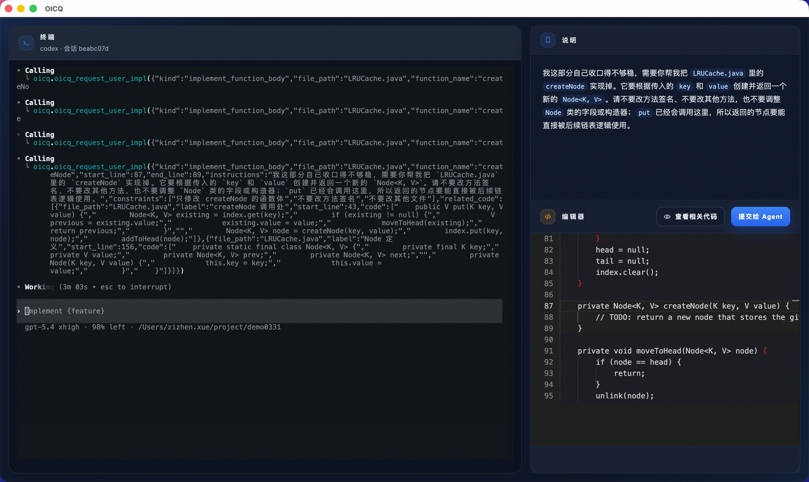

# OICQ

[简体中文](./README.zh-CN.md) | English

> OfCourse I Code the Quintessence

OICQ is an IDE that advocates old-school programming. In an era where vibe coding runs wild, this IDE lets you confidently tell your manager, "OfCourse I Code the Quintessence."



## Downloads

- macOS (Apple Silicon): [oicq-mac-arm64.zip](https://github.com/Ninokunii/OICQ/releases/download/v1.0.0/oicq-mac-arm64.zip)
- Windows (x64): [oicq-win-x64.zip](https://github.com/Ninokunii/OICQ/releases/download/v1.0.0/oicq-win-x64.zip)
- All releases: [GitHub Releases](https://github.com/Ninokunii/OICQ/releases)

## What It Does

In every smooth round of vibe coding, it intentionally leaves one extremely difficult function for the user to hand-write, something AI cannot implement on its own. Trust me, it really is extremely difficult.

## Prerequisites

### For Release Builds

- macOS Apple Silicon or Windows x64
- `claude` or `codex` installed and available in `PATH`

### For Running From Source

- Node.js `>= 20`
- `npm`
- `claude` or `codex` installed and available in `PATH`

## Quick Start

### Using A Release Build

The packaged desktop builds always run in desktop editor mode.

macOS:

```bash
./oicq.app/Contents/MacOS/oicq --provider claude --cwd /absolute/path/to/repo
```

Windows:

```powershell
.\oicq.exe --provider claude --cwd C:\absolute\path\to\repo
```

### Running From Source

```bash
npm install
npm run build
npm link
oicq --provider claude --editor web --cwd /absolute/path/to/repo
```

## Usage

```bash
oicq [--provider claude|codex] [--editor desktop|web|tui] [--cwd PATH] [-real|--real] [--extra-prompt TEXT] [-- PROVIDER_ARGS...]
oicq launch [--provider claude|codex] [--editor desktop|web|tui] [--cwd PATH] [-real|--real] [--extra-prompt TEXT] [-- PROVIDER_ARGS...]
oicq editor --session-dir PATH
oicq web-editor --session-dir PATH
oicq mcp-server --session-dir PATH
```

Examples:

```bash
oicq --provider claude --editor web --cwd /absolute/path/to/repo
oicq --provider codex --editor tui --cwd /absolute/path/to/repo
oicq --provider claude --editor desktop --cwd /absolute/path/to/repo -- --dangerously-skip-permissions
oicq --provider codex --editor web --cwd /absolute/path/to/repo --real
```

## Real Mode

For users looking for just a little challenge, try `--real`.

## Notes

- The current desktop release builds are unsigned. macOS and Windows may show first-launch security warnings.
- The macOS build is ad-hoc signed and not notarized.
